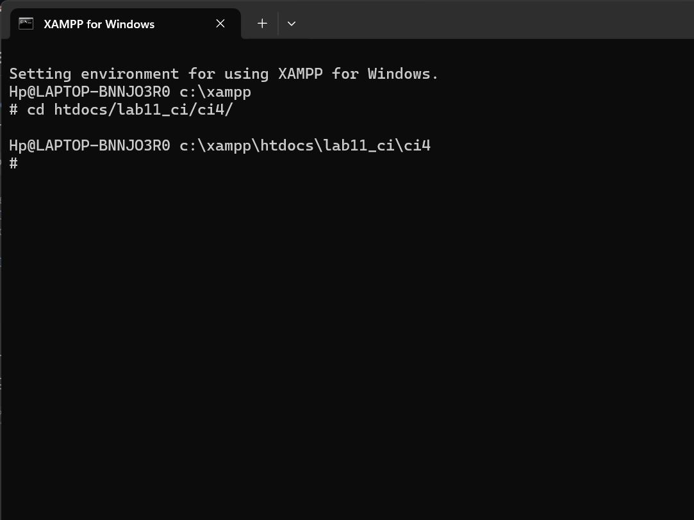
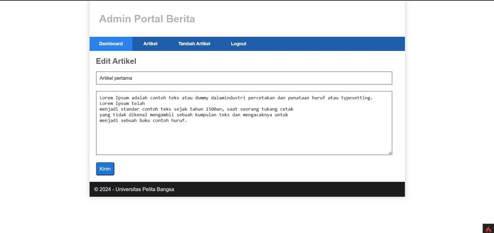

# Praktikum_Ci4

`Nama  : Muhammad Riyadus Solihin`

`Nim   : 312210404`

`Kelas : TI.22.A4`

# Praktikum 1: PHP Framework (Codeigniter)

## Langkah-langkah Praktikum

1. Persiapan
   Sebelum memulai menggunakan Framework Codeigniter, perlu dilakukan konfigurasi pada webserver. Beberapa ekstensi PHP perlu diaktifkan untuk kebutuhan pengembangan Codeigniter 4
   Berikut beberapa ekstensi yang perlu diaktifkan:

   - php-json ekstension untuk bekerja dengan JSON;
   - php-mysqlnd native driver untuk MySQL;
   - php-xml ekstension untuk bekerja dengan XML;
   - php-intl ekstensi untuk membuat aplikasi multibahasa;
   - libcurl (opsional), jika ingin pakai Curl.

Untuk mengaktifkan ekstentsi tersebut, melalu XAMPP Control Panel, pada bagian Apache klik Config -> PHP.in


2. Pada bagian extention, hilangkan tanda ; (titik koma) pada ekstensi yang akan diaktifkan. Kemudian simpan kembali filenya dan restart Apache web server


## Instalasi Codeigniter 4

Untuk melakukan instalasi Codeigniter 4 dapat dilakukan dengan dua cara, yaitu cara manual dan menggunakan composer. Pada praktikum ini kita menggunakan cara manual.

- Unduh Codeigniter dari website https://codeigniter.com/download
- Extrak file zip Codeigniter ke direktori htdocs/lab11_ci.
- Ubah nama direktory framework-4.x.xx menjadi ci4.
- Buka browser dengan alamat http://localhost/lab11_ci/ci4/public/


## Menjalankan CLI (Command Line Interface)

1. Codeigniter 4 menyediakan CLI untuk mempermudah proses development. Untuk mengakses CLI buka terminal/command prompt.



2. Arahkan lokasi direktori sesuai dengan direktori kerja project dibuat (xampp/htdocs/lab11_ci/ci4/) Perintah yang dapat dijalankan untuk memanggil CLI Codeigniter adalah:


## Mengaktifkan Mode Debugging

1. Codeigniter 4 menyediakan fitur debugging untuk memudahkan developer untuk mengetahui pesan error apabila terjadi kesalahan dalam membuat kode program. Secara default fitur ini belum aktif. Ketika terjadi error pada aplikasi akan ditampilkan pesan kesalahan seperti berikut:


2. Semua jenis error akan ditampilkan sama. Untuk memudahkan mengetahui jenis errornya, maka perlu diaktifkan mode debugging dengan mengubah nilai konfigurasi pada environment variable `CI_ENVIRINMENT` menjadi `development`.


Ubah nama file `env` menjadi `.env` kemudian buka file tersebut dan ubah nilai variable
CI_ENVIRINMENT menjadi development.


Contoh error yang terjadi. Untuk mencoba error tersebut, ubah kode pada file
app/Controller/Home.php hilangkan titik koma pada akhir kode

## Routing dan Controller

Routing merupakan proses yang mengatur arah atau rute dari request untuk menentukan fungsi/bagian mana yang akan memproses request tersebut. Pada framework CI4, routing bertujuan untuk menentukan Controller mana yang harus merespon sebuah request. Controller adalah class atau script yang bertanggung jawab merespon sebuah request. Pada Codeigniter, request yang diterima oleh file index.php akan diarahkan ke Router untuk meudian oleh router tesebut diarahkan ke Controller.

Router terletak pada file app/config/Routes.php

1. Pada file tersebut kita dapat mendefinisikan route untuk aplikasi yang kita buat.

```php
$routes->get('/', 'Home::index');
```

Kode tersebut akan mengarahkan rute untuk halaman home.

2. Tambahkan kode berikut di dalam Routes.php

```php
$routes->get('/about', 'Page::about');
$routes->get('/contact', 'Page::contact');
$routes->get('/faqs', 'Page::faqs');
```


3. Untuk mengetahui route yang ditambahkan sudah benar, buka CLI dan jalankan perintah
   berikut
   `php spark routes`


4. Selanjutnya coba akses route yang telah dibuat dengan mengakses alamat url


Ketika diakses akan mucul tampilan error 404 file not found, itu artinya file/page tersebut tida ada. Untuk dapat mengakses halaman tersebut, harus dibuat terlebih dahulu Contoller yang sesuai dengan routing yang dibuat yaitu Contoller Page

## Membuat Controller

1. Selanjutnya adalah membuat Controller Page. Buat file baru dengan nama page.php pada direktori Controller kemudian isi kodenya seperti berikut.

```php
<?php
namespace App\Controllers;
class Page extends BaseController
{
    public function about()
    {
        echo "Ini halaman About";
    }
    public function contact()
    {
        echo "Ini halaman Contact";
    }
    public function faqs()
    {
        echo "Ini halaman FAQ";
    }
}
```

2. Selanjutnya refresh Kembali browser, maka akan ditampilkan hasilnya yaitu halaman sudah dapat diakses.


## Auto Routing

1. Secara default fitur autoroute pada Codeiginiter sudah aktif. Untuk mengubah status autoroute dapat mengubah nilai variabelnya. Untuk menonaktifkan ubah nilai true menjadi false.

`$routes->setAutoRoute(true);`

2. Tambahkan method baru pada Controller Page seperti berikut.

```php
public function tos()
{
echo "ini halaman Term of Services";
}
```

Method ini belum ada pada routing, sehingga cara mengaksesnya dengan menggunakan
alamat: http://localhost:8080/page/tos


## Membuat View

1. Selanjutnya adalam membuat view untuk tampilan web agar lebih menarik. Buat file baru dengan nama about.php pada direktori view (app/view/about.php) kemudian isi kodenya seperti berikut:

```html
<!DOCTYPE html>
<html lang="en">
  <head>
    <meta charset="UTF-8" />
    <meta http-equiv="X-UA-Compatible" content="IE=edge" />
    <meta name="viewport" content="width=device-width, initial-scale=1.0" />
    <title><?= $title; ?></title>
  </head>
  <body>
    <h1><?= $title; ?></h1>
    <hr />
    <p><?= $content; ?></p>
  </body>
</html>
```

2. Ubah method about pada class Controller Page menjadi seperti berikut:

```php
public function about(){
    return view('about', [
        'title' => 'Halaman About',
        'content' => 'Ini adalah Halaman About yang menjelaskan tentang isi halaman, dibuat melalui Views'
    ]);
}
```

3. Kemudian lakukan refresh pada halaman tersebut.


## Membuat Layout Web dengan CSS

Pada dasarnya layout web dengan css dapat diimplamentasikan dengan mudah pada codeigniter. Yang perlu diketahui adalah, pada Codeigniter 4 file yang menyimpan asset css dan javascript terletak pada direktori public.

1.  Buat file css pada direktori public dengan nama style.css copy file dari praktikum lab4_layout. Kita akan gunakan layout yang pernah dibuat pada praktikum 4.

2.  Kemudian buat folder template pada direktori view kemudian buat file `header.php` dan `footer.php`


3. Kemudian ubah file app/view/about.php seperti berikut


### Output Final Tampilan Website Praktikum 1


# Praktikum 2: Framework Lanjutan (CRUD)

## Langkah-Langkah Praktikum

1. Persiapan
   Untuk memulai membuat aplikasi CRUD sederhana,
   yang perlu disiapkan adalah database server menggunakan MySQL.
   Pastikan MySQL Server sudah dapat dijalankan melalui
   XAMPP

2. Membuat Database: Studi Kasus Data Artikel

```sql
CREATE DATABASE lab_ci4;
```

```sql
CREATE TABLE artikel (
id INT(11) auto_increment,
judul VARCHAR(200) NOT NULL,
isi TEXT,
gambar VARCHAR(200),
status TINYINT(1) DEFAULT 0,
slug VARCHAR(200),
PRIMARY KEY(id)
);
```


3. Konfigurasi koneksi database

Selanjutnya membuat konfigurasi untuk menghubungkan dengan database server.
Konfigurasi dapat dilakukan dengan du acara, yaitu pada file `app/config/database.php` atau menggunakan file `.env`.
Pada praktikum ini kita gunakan konfigurasi pada file `.env`.


3. Membuat Model dan Controllers

Selanjutnya adalah membuat Model untuk memproses data Artikel. Buat file baru pada direktori `app/Models` dengan nama `ArtikelModel.php` dan membuat Controller baru dengan nama `Artikel.php` pada direktori `app/Controllers`.

```php
<?php
namespace App\Models;
use CodeIgniter\Model;
class ArtikelModel extends Model
{
 protected $table = 'artikel';
 protected $primaryKey = 'id';
 protected $useAutoIncrement = true;
 protected $allowedFields = ['judul', 'isi', 'status', 'slug',
'gambar'];
}

```

```php
<?php
namespace App\Controllers;
use App\Models\ArtikelModel;
class Artikel extends BaseController
{
 public function index()
 {
 $title = 'Daftar Artikel';
 $model = new ArtikelModel();
 $artikel = $model->findAll();
 return view('artikel/index', compact('artikel', 'title'));
 }
}
```

4. Membuat View

Buat direktori baru dengan nama artikel pada direktori `app/views`, kemudian buat file baru
dengan nama `index.php`.

```php
<?= $this->include('template/header'); ?>
<?php if($artikel): foreach($artikel as $row): ?>
<article class="entry">
 <h2<a href="<?= base_url('/artikel/' . $row['slug']);?>"><?=
$row['judul']; ?></a>
</h2>
 " alt="<?=
$row['judul']; ?>">
 <p><?= substr($row['isi'], 0, 200); ?></p>
</article>
<hr class="divider" />
<?php endforeach; else: ?>
<article class="entry">
 <h2>Belum ada data.</h2>
</article>
<?php endif; ?>
<?= $this->include('template/footer'); ?>
```


Belum ada data yang diampilkan. Kemudian coba tambahkan beberapa data pada database agar
dapat ditampilkan datanya.


5. Membuat Tampilan Detail Artikel

Tampilan pada saat judul berita di klik maka akan diarahkan ke halaman yang berbeda.
Tambahkan fungsi baru pada Controller Artikel dengan nama view().

```php
public function view($slug)
{
$model = new ArtikelModel();
$artikel = $model->where(['slug' => $slug])->first();

// Menampilkan error apabila data tidak ada.
if (!$artikel) {
throw PageNotFoundException::forPageNotFound();
}
$title = $artikel['judul'];
return view('artikel/detail', compact('artikel', 'title'));
}
```

Buat view baru untuk halaman detail dengan nama app/views/artikel/detail.php.

```php
   <?= $this->include('template/header'); ?>

    <article class="entry">
        <h2><?= $artikel['judul']; ?></h2>
        " alt="<?= $artikel['judul']; ?>">
        <p><?= $artikel['isi']; ?></p>
    </article>

    <?= $this->include('template/footer'); ?>
```


Selanjutnya, buka kembali file app/config/Routes.php, kemudian tambahkan routing untuk artikel detail.

```php
$routes->get('/artikel/(:any)', 'Artikel::view/$1');
```


6. Membuat Menu Admin

Menu admin adalah untuk proses CRUD data artikel.
Buat method baru pada Controller Artikel dengan nama admin_index().

```php
public function admin_index()
 {
 $title = 'Daftar Artikel';
 $model = new ArtikelModel();
 $artikel = $model->findAll();
 return view('artikel/admin_index', compact('artikel', 'title'));
 }
```

Selanjutnya buat view untuk tampilan admin dengan nama admin_index.php

```php
<?= $this->include('template/admin_header'); ?>
<table class="table">
 <thead>
 <tr>
 <th>ID</th>
 <th>Judul</th>
 <th>Status</th>
 <th>AKsi</th>
 </tr>
 </thead>
 <tbody>
 <?php if($artikel): foreach($artikel as $row): ?>
 <tr>
 <td><?= $row['id']; ?></td>
 <td>
 <b><?= $row['judul']; ?></b>
 <p><small><?= substr($row['isi'], 0, 50); ?></small></p>
 </td>
 <td><?= $row['status']; ?></td>
 <td>
 <a class="btn" href="<?= base_url('/admin/artikel/edit/' .
$row['id']);?>">Ubah</a>
 <a class="btn btn-danger" onclick="return confirm('Yakin
menghapus data?');" href="<?= base_url('/admin/artikel/delete/' .
$row['id']);?>">Hapus</a>
 </td>
 </tr>
 <?php endforeach; else: ?>
 <tr>
 <td colspan="4">Belum ada data.</td>
 </tr>
 <?php endif; ?>
 </tbody>
 <tfoot>
 <tr>
 <th>ID</th>
 <th>Judul</th>
 <th>Status</th>
 <th>AKsi</th>
 </tr>
 </tfoot>
</table>
<?= $this->include('template/admin_footer'); ?>
```

Tambahkan routing untuk menu admin seperti berikut:

```php
$routes->group('admin', function($routes) {
$routes->get('artikel', 'Artikel::admin_index');
$routes->add('artikel/add', 'Artikel::add');
$routes->add('artikel/edit/(:any)', 'Artikel::edit/$1');
$routes->get('artikel/delete/(:any)', 'Artikel::delete/$1');
});
```


7. Menambah Data Artikel

Tambahkan fungsi/method baru pada Controller Artikel dengan nama add().

```php
public function add()
 {
 // validasi data.
 $validation = \Config\Services::validation();
 $validation->setRules(['judul' => 'required']);
 $isDataValid = $validation->withRequest($this->request)->run();
 if ($isDataValid)
 {
 $artikel = new ArtikelModel();
 $artikel->insert([
 'judul' => $this->request->getPost('judul'),
'isi' => $this->request->getPost('isi'),
 'slug' => url_title($this->request->getPost('judul')),
 ]);
 return redirect('admin/artikel');
 }
 $title = "Tambah Artikel";
 return view('artikel/form_add', compact('title'));
 }
```

Kemudian buat view untuk form tambah dengan nama form_add.php

```php
<?= $this->include('template/admin_header'); ?>
<h2><?= $title; ?></h2>
<form action="" method="post">
 <p>
 <input type="text" name="judul">
 </p>
 <p>
 <textarea name="isi" cols="50" rows="10"></textarea>
 </p>
 <p><input type="submit" value="Kirim" class="btn btn-large"></p>
</form>
<?= $this->include('template/admin_footer'); ?>
```


8. Mengubah Data

Tambahkan fungsi/method baru pada Controller Artikel dengan nama edit().

```php
public function edit($id)
 {
 $artikel = new ArtikelModel();
 // validasi data.
 $validation = \Config\Services::validation();
 $validation->setRules(['judul' => 'required']);
 $isDataValid = $validation->withRequest($this->request)->run();
 if ($isDataValid)
 {
 $artikel->update($id, [
 'judul' => $this->request->getPost('judul'),
 'isi' => $this->request->getPost('isi'),
 ]);
 return redirect('admin/artikel');
 }
 // ambil data lama
 $data = $artikel->where('id', $id)->first();
 $title = "Edit Artikel";
 return view('artikel/form_edit', compact('title', 'data'));
 }
```

```php
Kemudian buat view untuk form tambah dengan nama form_edit.php

<?= $this->include('template/admin_header'); ?>
<h2><?= $title; ?></h2>
<form action="" method="post">
 <p>
 <input type="text" name="judul" value="<?= $data['judul'];?>" >
 </p>
 <p>
 <textarea name="isi" cols="50" rows="10"><?=
$data['isi'];?></textarea>
 </p>
 <p><input type="submit" value="Kirim" class="btn btn-large"></p>
</form>
<?= $this->include('template/admin_footer'); ?>
```



9. Menghapus Data

Tambahkan fungsi/method baru pada Controller Artikel dengan nama delete().

```php
public function delete($id)
 {
 $artikel = new ArtikelModel();
 $artikel->delete($id);
 return redirect('admin/artikel');
 }
```

# Praktikum 3: View Layout dan View Cell

## Deskripsi
Praktikum ini bertujuan untuk memahami dan mengimplementasikan konsep **View Layout** dan **View Cell** dalam CodeIgniter 4. Dengan menggunakan View Layout, kita dapat membuat template tampilan yang dapat digunakan kembali. Sedangkan View Cell memungkinkan kita memanggil komponen UI secara modular.

## Tujuan Praktikum
Setelah menyelesaikan praktikum ini, mahasiswa diharapkan dapat:
1. Memahami konsep **View Layout** di CodeIgniter 4.
2. Menggunakan **View Layout** untuk membuat template tampilan.
3. Memahami dan mengimplementasikan **View Cell** dalam CodeIgniter 4.
4. Menggunakan **View Cell** untuk memanggil komponen UI secara modular.

## Instruksi Praktikum
1. Persiapkan text editor, misalnya **VSCode**.
2. Buka kembali folder `lab7_php_ci` pada **docroot** webserver (`htdocs`).
3. Ikuti langkah-langkah berikut untuk menyelesaikan praktikum.

## Langkah-langkah Praktikum

### 1. Membuat Layout Utama
Buat folder `layout` di dalam `app/Views/` lalu buat file `main.php` dengan kode berikut:

```php
<!DOCTYPE html>
<html lang="en">
<head>
    <meta charset="UTF-8">
    <title><?= $title ?? 'My Website' ?></title>
    <link rel="stylesheet" href="<?= base_url('/style.css');?>">
</head>
<body>
    <div id="container">
        <header>
            <h1>Layout Sederhana</h1>
        </header>
        <nav>
            <a href="<?= base_url('/'); ?>" class="active">Home</a>
            <a href="<?= base_url('/artikel'); ?>">Artikel</a>
            <a href="<?= base_url('/about'); ?>">About</a>
            <a href="<?= base_url('/contact'); ?>">Kontak</a>
        </nav>
        <section id="wrapper">
            <section id="main">
                <?= $this->renderSection('content') ?>
            </section>
            <aside id="sidebar">
                <?= view_cell('App\\Cells\\ArtikelTerkini::render') ?>
            </aside>
        </section>
        <footer>
            <p>&copy; 2021 - Universitas Pelita Bangsa</p>
        </footer>
    </div>
</body>
</html>
```

### 2. Modifikasi File View
Ubah `app/Views/home.php` agar sesuai dengan layout baru:
```php
<?= $this->extend('layout/main') ?>

<?= $this->section('content') ?>

<h1><?= $title; ?></h1>
<hr>
<p><?= $content; ?></p>

<?= $this->endSection() ?>
```

### 3. Menampilkan Data Dinamis dengan View Cell
View Cell memungkinkan pemanggilan tampilan dalam bentuk komponen yang dapat digunakan ulang.

#### a. Membuat Class View Cell
Buat folder `Cells` di dalam `app/`, lalu buat file `ArtikelTerkini.php` dengan kode berikut:
```php
<?php

namespace App\Cells;

use CodeIgniter\View\Cell;
use App\Models\ArtikelModel;

class ArtikelTerkini extends Cell
{
    public function render()
    {
        $model = new ArtikelModel();
        $artikel = $model->orderBy('created_at', 'DESC')->limit(5)->findAll();
        
        return view('components/artikel_terkini', ['artikel' => $artikel]);
    }
}
```

#### b. Membuat View untuk View Cell
Buat folder `components` di dalam `app/Views/`, lalu buat file `artikel_terkini.php` dengan kode berikut:
```php
<h3>Artikel Terkini</h3>
<ul>
    <?php foreach ($artikel as $row): ?>
    <li><a href="<?= base_url('/artikel/' . $row['slug']) ?>"><?= $row['judul'] ?></a></li>
    <?php endforeach; ?>
</ul>
```
